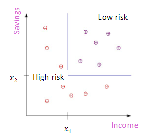
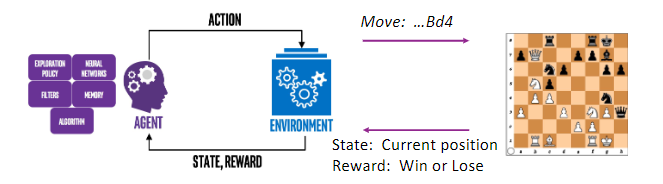
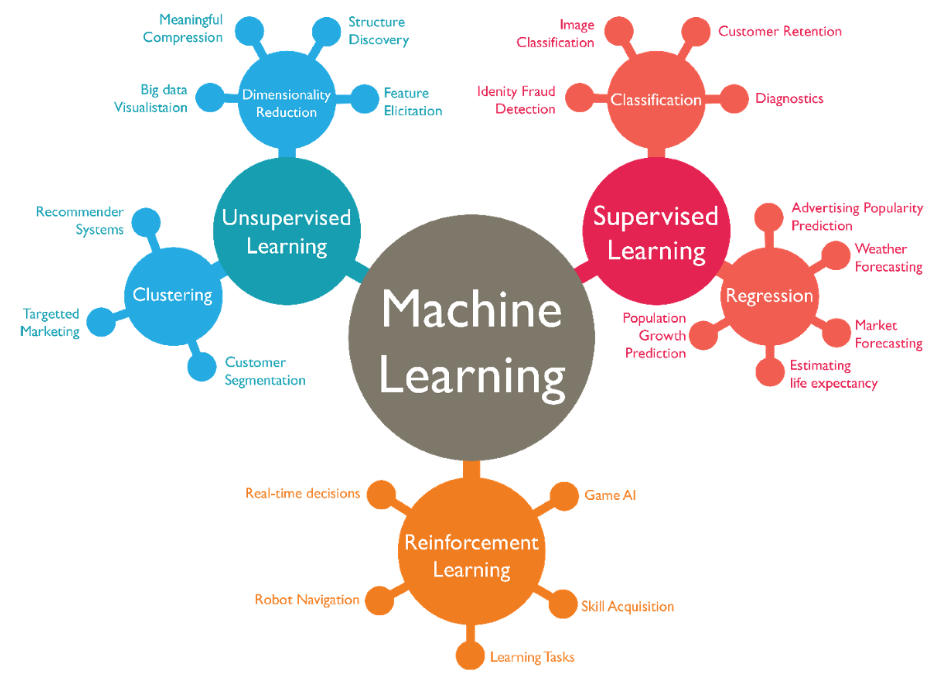

# Machine Learning

## Unit 1: What is Machine Learning?

### Learning objectives

In this unit, we need to:

1. Identify data-driven learning vs, expert/domain knowledge -based approaches  
学会分辨数据驱动学习与专家/领域学习方法的区别  
2. For a new project, describe how machine learning can be used  
   * Formulate a potential machine learning task  
制定一个潜在的机器学习任务  
   * Identify the data needed for the task  
识别任务需要的数据  
   * Identify objects  
识别对象  
  
3. Classify a machine learning task
   * Supervised vs. unsupervised, regression vs. classification
监督学习/非监督学习，回归学习/分类学习  
  
### Machine Learning: Learn from data

Why?

* Human expertise does not exist (ex: complex medical processes we don’t fully understand)
* Humans are unable to explain their expertise (speech recognition)
* Solution change or adapt in time (routing on a computer network)
  
### EX1：How to recgnize digits from a image?  

如何辨认图像中的数字？

1. 经典的“专家”方式
   * “你”会做这项任务，你就是专家——利用你对图像中数字的知识
   * 建立辨认的简单方式，并用代码描述
   * 这就是你的专家规则 _对7来说，由一条竖直线和一条水平线组成_
   * 这个规则似乎简单又合理，但是……

2. 专家方式的问题
   * 简单的规则无法实际生效  
     很难定义“一条线”  
     朝向、长度、粗细……  
     也许有不同的写法
   * 最普遍的问题： 我们不能轻易地将知识代码化  
     我们可以做这个任务，但是很难将知识转化为简单的数学公式

3. 机器学习方式：从数据中学习
   * 不要使用你的“专家”知识
   * 从数据中学习识别函数！
   * 监督学习：  
     取得许多打了标签的例子$(x_i,y_i),i=1,...,N$ ——称为训练数据  
     每个例子都含有一个输入$x_i$和输出$y_i$  
     学习得到一个函数$f(x)$满足：$f(x_i)=y_i$，此函数对“大多数”例子有效

### ML Approach Benefits and Challenges

1. 优点：正确率很高（>99.8%）；在商业应用中很成熟；专家方式无法达到同样的效果
2. 挑战：  
   * 如何取得数据？ 有人必须手动给数据打标签
   * 我们如何将一系列函数$f(x)$参数化来进行搜索？
   * 我们如何把函数与数据相适应？
   * 如果函数在训练数据中有效，它在新数据中是否通用？
3. 这就是你将要学习的

#### EX2：Face Detection

如何从图像的某个区域识别这是否是人脸？

#### 监督学习方式

1. 数据：取得大量人脸与非人脸数据
2. 典型的早期数据集  

   * 5000张人脸（接近正面，不同年龄、民族、性别、肤色）  
   * $10^8$张非人脸图片  
   * 人脸被统一化（格式、转化）
  
3. 从一系列函数中学习分类方法

   * 每个函数都从图像指向二进制数“人脸”或“非人脸”
   * 选择那些训练中表现很好的函数
   * 为了达到好的效果，函数也许会很复杂
   * 很多的参数

4. 现在有许多数据集可用：
   * 比如[人脸识别数据库](http://www.face-rec.org/databases/)

#### EX3: Spam Detection

1. 分类问题
   * 邮件是否是垃圾邮件？
2. 为了机器学习，必须用数字代表邮件
   * 常用模型：词汇袋
   * 列举所有单词，$i=1,...,N$
   * 通过词数代表电子邮件  
      $x_i=$单词i在邮件中的实例编号
3. 挑战：
   * 超高维数组
   * 系统必须持续适应（新的骚扰邮件）

#### EX4: Stock Price Prediction

* 你能预测股票价格吗？
* 你需要哪些数据？
* 非机器学习的方式是什么样的？

### Machine Learning in Many Fields

* 零售业：市场调研、客户关系管理（CRM）
* 金融业：信用评分、欺诈检测
* 制造业：控制、机器人、故障排除
* 医药：医学诊断
* 无线通信：骚扰过滤器、入侵检测
* 生物信息学：基因序列、基因排列
* 网络挖掘：搜索引擎

#### 课堂训练（仅记录自己的想法）

以下是否是机器学习？

1. 机器人通过最短距离算法+障碍物位置决定路线——N
2. 你通过过往天气数据预测明天的天气——y
3. 电脑程序通过计算手中牌的胜率来决定是否梭哈——N
4. 一个程序通过过往客户的购物偏好估计一位顾客是否会买某商品——y

### 机器学习的分类

1. 分类算法
   * 监督学习——从特征x到目标y
   * 目标是离散的，是有限值中的一个数  
比如：$y\subset\{0,1\}$
   * 示例：信用评估  
目标：客户为高风险/低风险
特点：收入&储蓄$\textbf{x}=(x_1,x_2)$
   * 从特点和目标学习一个函数  
用之前的训练数据  

   * 下边的图是一个决策树  
  

2. 回归算法
   * 也是监督算法
   * 预测连续的目标，目标是连续量
   * 示例：  
预测y=幸福指数（问卷调查中得到）  
x为收入、国家、年龄……
可以使用多个预测
   * 假设映射的某种形式  
比如线性的：$y=\beta_0+\beta_1x$
从数据中找到合适的$\beta_0,\beta_1$

3. 非监督学习
   * 学习“通常会发生什么”
   * 没有输出——只有x没有y
   * 聚类：对相似实例进行分组
   * 几个例子  
      * 客户细分
      * 图像压缩：颜色量化
      * 生物信息学：学习动机

4. 强化学习（深度学习）
   * 智能体学习做出与环境交互的动作，以最大化奖励
      * 通常在闭环系统中作用
   * 关键的权衡点：
      * 开发（从过去知识中学习）vs. 探索（尝试新的选择）
      * 信用分配：哪些过去的行为将会导致当前的奖励？
  
以国际象棋为例的深度学习机制

5. 机器学习的关系网图  
     
